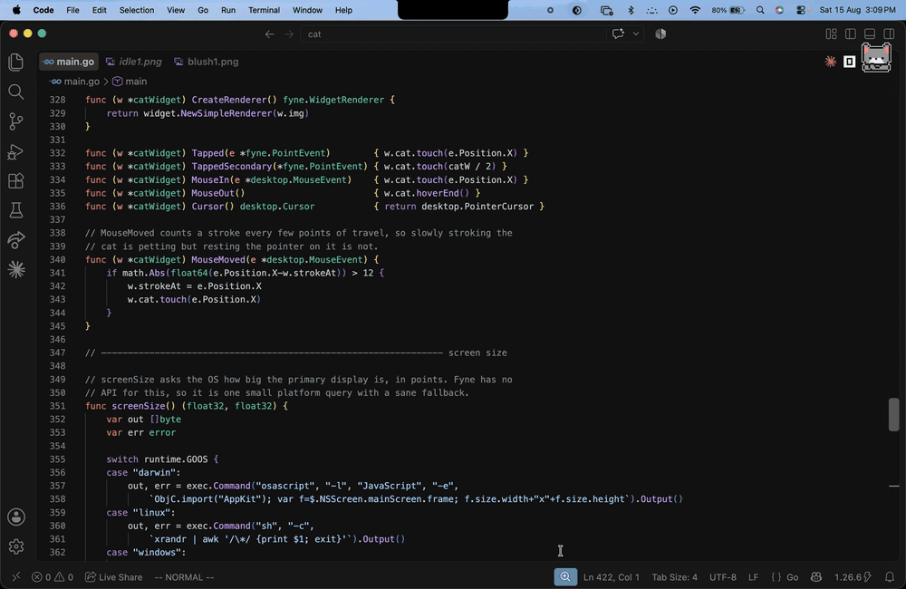

# kitty

A small pixel-art cat that lives on your desktop. It wanders around, follows your
mouse cursor when it feels like it, curls up for a nap on its own schedule, and
gets grumpy if you pet it too much.

[](https://github.com/MohakGupta2004/kitty/actions/workflows/ci.yml)
[](https://github.com/MohakGupta2004/kitty/releases/latest)
[](LICENSE)



<sub>▶ [Watch the full screen recording](docs/demo.mp4)</sub>

## Install

Grab a build from the [latest release](https://github.com/MohakGupta2004/kitty/releases/latest).

### macOS

Download `Kitty-<version>-macos-universal.zip` (Apple Silicon and Intel in one
bundle), unzip it and drag **Kitty.app** into Applications.

The app is not signed with an Apple developer certificate, so the first launch
needs one extra step: **right-click the app → Open → Open**. If macOS refuses
outright, clear the quarantine flag and try again:

```sh
xattr -dr com.apple.quarantine /Applications/Kitty.app
```

### Linux

```sh
tar -xzf kitty-<version>-linux-amd64.tar.gz
./kitty
```

X11 is required for cursor following (see [Platform notes](#platform-notes)).

### Windows

Download `kitty-<version>-windows-amd64.zip`, unzip it and run `kitty.exe`.

### From source

Go 1.26 or newer, plus a C toolchain (Fyne uses OpenGL through cgo). On Debian
or Ubuntu: `sudo apt install libgl1-mesa-dev xorg-dev libxkbcommon-dev`.

```sh
git clone https://github.com/MohakGupta2004/kitty
cd kitty
make build      # -> dist/kitty
make package    # -> dist/Kitty.app (macOS)
```

## Using it

Run it and the cat appears in the middle of the screen. There is no window
frame, so everything is done through the cat itself and the tray menu:

| You do this | The cat does this |
| --- | --- |
| Move the mouse nearby | Trots over and sits down next to the pointer |
| Leave the mouse alone | Loses interest and goes back to wandering |
| Nothing, for a while | Lies down and takes a nap, ignoring the cursor entirely |
| Hover or stroke it | Blushes and enjoys it |
| Keep petting past its limit | X eyes, then it bolts to the other side of the screen |
| Poke it while it is asleep | Wakes up, and about half the time it is not pleased |

The tray icon (menu bar on macOS, notification area elsewhere) has **Follow the
cursor** to toggle chasing, **Take a nap / Wake up** to override the schedule,
and **Quit**.

### Command line flags

| Flag | What it does |
| --- | --- |
| `-version` | Print the version and exit |
| `-config PATH` | Use a config file somewhere other than the default |
| `-no-follow` | Start with cursor following turned off |
| `-scale N` | Sprite scale, 0.5 to 4 (a 2 makes it twice as big) |
| `-verbose` | Log every state change |

## Configuration

A config file is written on first run:

| OS | Path |
| --- | --- |
| macOS | `~/Library/Application Support/desktop-kitty/config.json` |
| Linux | `~/.config/desktop-kitty/config.json` |
| Windows | `%AppData%\desktop-kitty\config.json` |

Edit it and restart. Anything you leave out keeps its default, and a value that
cannot work is reported at start-up instead of being silently ignored.

```json
{
  "tick_ms": 100,
  "walk_speed": 3,
  "follow_speed": 5,
  "flee_speed": 9,
  "follow_radius": 520,
  "give_up_radius": 900,
  "follow_standoff": 60,
  "follow_chance": 70,
  "follow_max_sec": 25,
  "cursor_still_sec": 4,
  "awake_min_sec": 90,
  "awake_max_sec": 210,
  "sleep_min_sec": 45,
  "sleep_max_sec": 120,
  "pets_before_annoyed": 6,
  "pet_patience_sec": 6,
  "scale": 1,
  "always_on_top": true,
  "tray": true
}
```

The interesting knobs:

- **`follow_chance`** — how often the cat bothers to chase the cursor at all.
  Set it to `100` for a clingy cat, `0` for one that only ever wanders.
- **`follow_radius` / `give_up_radius`** — how close the cursor has to be before
  it is noticed, and how far it has to run before the cat gives up.
- **`follow_standoff`** — how far from the pointer the cat sits down. Keep it
  above about 40 or the cat will end up under your cursor and get petted every
  time you move the mouse.
- **`cursor_still_sec`** — a cursor that has not moved for this long stops being
  interesting, so a parked pointer will not hold the cat's attention forever.
- **`awake_*` / `sleep_*`** — the nap schedule. The cat is awake for a random
  stretch inside the awake range, then sleeps for one inside the sleep range and
  ignores the cursor completely while it does.

## Platform notes

- **macOS** — cursor position comes from Quartz and needs no accessibility
  permission. The app is unsigned, hence the right-click-to-open dance above.
- **Linux/X11** — works out of the box.
- **Linux/Wayland** — there is no unprivileged way to read the global cursor
  position, so the cat wanders but never follows. A warning is logged at
  start-up. Everything else works through XWayland.
- **Windows** — works out of the box.

The cat's window sits above other windows and swallows clicks that land on it,
which is why it stops a little short of your cursor rather than sitting on top
of it.

## How it works

- `cat.go` — the whole behaviour: a tick-driven state machine (idle, wander,
  follow, falling asleep, asleep, waking up, angry, being petted) with no UI
  dependencies at all, which is what makes it testable.
- `sprites.go` — the embedded sprite sheet and the state → frame mapping.
- `widget.go` — the Fyne widget, plus the two-part trick for a genuinely
  transparent window: a zero-alpha theme background and a GLFW
  `TransparentFramebuffer` hint set in the gap between GLFW init and window
  creation.
- `cursor_*.go` — the global cursor position, one small implementation per
  platform: Quartz on macOS, `GetCursorPos` on Windows, `XQueryPointer` on X11.
- `screen.go` — display size, re-measured every minute so docking a laptop or
  switching monitors does not leave the cat walking into an invisible wall.
- `config.go` — the JSON config, its defaults and its validation.

```sh
make check   # go vet + go test -race
```

## License

[MIT](LICENSE). The pixel-art sprites live in `assets/`.
